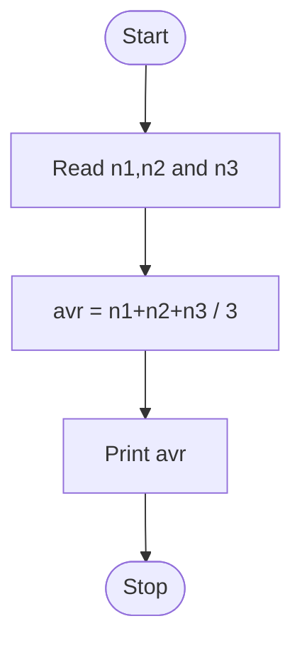
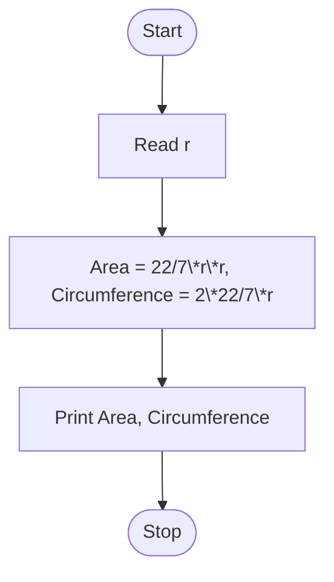
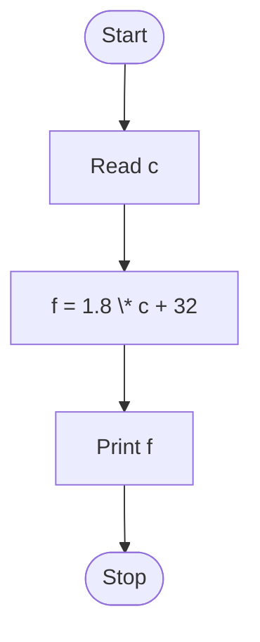
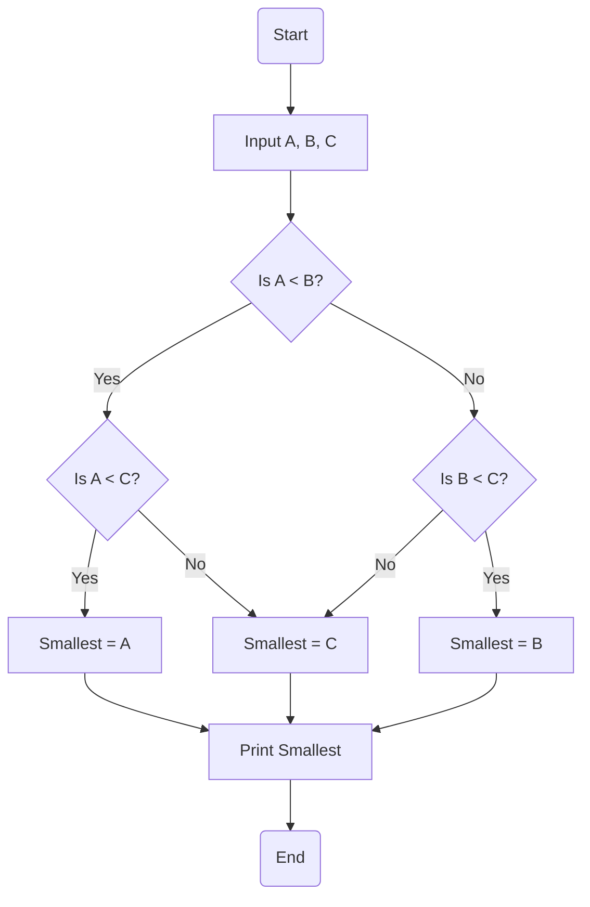
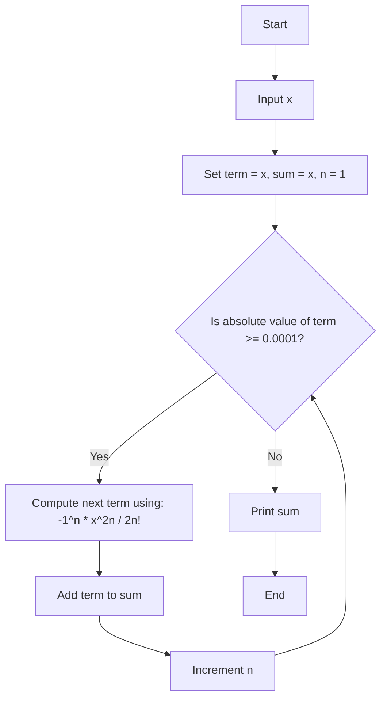

# REVIEW QUESTIONS AND EXERCISES

1. Write the algorithm and draw the flowchart to find the average of given 3 values.<br>

Ans : 
```
1. Read n1,n2 and n3 , where n repesent number.
2. avr = n1+n2+n3 / 3
3. print avr  
```
FLOWCHART : <br>




2. Write the algorithm and draw the flowchart to find the area and circumference of a circle of radius r.

[**Hint**: Area= πr²; Circumference = 2πr]<br>

Ans : 

```
1. Read r
2. Area = 22/7 \* r\*r , Circumference = 2\*22/7\*r
3. Print Area, Circumference
```

Flowchart :


3. Write the algorithm and draw the flowchart to convert the temperature given in °c to °f.

[**Hint**: Use the relation °f= 1.8°c +32]<br>

Ans : 
```
1. Read c
2. f = 1.8 * c + 32
3. Print f 
```
Flowchart : 


4. Draw the flowchart to find the smallest of the given three numbers.
<br>
Ans :




6. Draw the flowchart to solve the following series which is the summation of cosine series <br>
$s = x - \frac{x^2}{2!} + \frac{x^4}{4!} - \frac{x^6}{6!} + \cdots \infty$ neglecting the terms which are less that 10^-4 in magnitude.
<br>
Ans :



[Hint: The method discussed in Example 8 can be used to solve this series with minor changes.]

6. Draw the flowchart to find the sum of natural numbers upto N.

[Hint: The method discussed in Example 10 can be used to solve the series, i.e. $s = 1 + 2+ 3 + 4 + ... + N$.]

7. Draw a flowchart to solve the following series:

$$s = 1 + \frac{1}{2!} + \frac{1}{3!} + \frac{1}{4!} + \cdots + \frac{1}{N!}$$

8. Draw a flowchart to solve the following series: <br>
$$e^x = 1 + x + \frac{x^2}{2!} + \frac{x^3}{3!} + \frac{x^4}{4!} + \cdots$$ ∞ <br>
Neglect the terms which are less than 10 in magnitude. 

# SHORT QUESTIONS

1. What is an algorithm?

2. What is a flowchart?

3. ______ programming method is followed in C language.

4. ______programming method is followed in C++.

5. Procedural programming method is commonly used for writing small programs which produce discrete results. (True/False)

6. Object-oriented programming method is commonly used to develop software packages to perform a task. (True/False)

7. Algorithms and flowcharts may be omitted after getting experience in writing program. (True/False)


